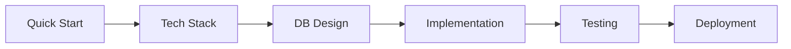
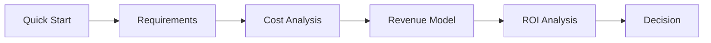
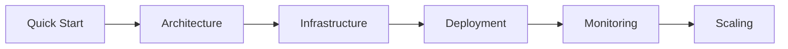

# 📑 Complete Documentation Index

**Quick navigation to all research documents.**

---

## 🎯 Start Here

- [**QUICK START**](./QUICK-START.md) - Get started in 30 minutes ⚡
- [**Main README**](./README.md) - Complete project overview 📋
- [**FAQ**](./FAQ.md) - Frequently asked questions ❓

---

## 📚 Core Documentation

### 1. Technology Stack
**Path:** `01-Technology-Stack/`

| Document | Description | Time |
|----------|-------------|------|
| [README](./01-Technology-Stack/README.md) | Stack overview & recommendations | 10 min |
| [Requirements Analysis](./01-Technology-Stack/01-requirements-analysis.md) | Detailed requirements breakdown | 20 min |
| [PostgreSQL Deep Dive](./01-Technology-Stack/02-postgresql.md) | Why PostgreSQL? Performance analysis | 15 min |
| [TimescaleDB Analysis](./01-Technology-Stack/03-timescaledb.md) | Time-series database evaluation | 15 min |
| [Elasticsearch Guide](./01-Technology-Stack/04-elasticsearch.md) | Search engine configuration | 15 min |
| [Redis Patterns](./01-Technology-Stack/05-redis.md) | Caching strategies | 10 min |
| [Comparison Matrix](./01-Technology-Stack/06-comparison-matrix.md) | Tech alternatives compared | 10 min |
| [Final Recommendations](./01-Technology-Stack/07-recommendations.md) | Decision summary | 5 min |

**Total Reading Time:** ~100 minutes

---

### 2. System Architecture
**Path:** `02-Architecture/`

| Document | Description | Time |
|----------|-------------|------|
| [README](./02-Architecture/README.md) | Architecture overview | 10 min |
| [High-Level Design](./02-Architecture/01-high-level-design.md) | System components | 15 min |
| [Data Flow](./02-Architecture/02-data-flow.md) | How data moves | 15 min |
| [Scalability Strategy](./02-Architecture/03-scalability.md) | Scaling approach | 20 min |
| [Multi-Region Setup](./02-Architecture/04-multi-region.md) | Global deployment | 20 min |
| [Security Architecture](./02-Architecture/05-security.md) | Security design | 15 min |

**Total Reading Time:** ~95 minutes

---

### 3. Database Design
**Path:** `03-Database-Design/`

| Document | Description | Time |
|----------|-------------|------|
| [README](./03-Database-Design/README.md) | Database overview | 10 min |
| [PostgreSQL Schema](./03-Database-Design/01-postgresql-schema.md) | Main DB schema | 30 min |
| [TimescaleDB Schema](./03-Database-Design/02-timescaledb-schema.md) | Time-series schema | 20 min |
| [Elasticsearch Indexes](./03-Database-Design/03-elasticsearch-indexes.md) | Search configuration | 20 min |
| [Redis Patterns](./03-Database-Design/04-redis-patterns.md) | Cache strategies | 15 min |
| [Data Models](./03-Database-Design/05-data-models.md) | Application models | 20 min |
| [Migration Strategy](./03-Database-Design/06-migration-strategy.md) | Schema evolution | 15 min |
| [Optimization Guide](./03-Database-Design/07-optimization-guide.md) | Performance tuning | 20 min |

**Total Reading Time:** ~150 minutes

---

### 4. Implementation
**Path:** `04-Implementation/`

| Document | Description | Time |
|----------|-------------|------|
| [README](./04-Implementation/README.md) | Implementation overview | 10 min |
| [Setup Guide](./04-Implementation/01-setup-guide.md) | Dev environment setup | 30 min |
| [Infrastructure Setup](./04-Implementation/02-infrastructure.md) | Cloud deployment | 45 min |
| [API Development](./04-Implementation/03-api-development.md) | Building the API | 60 min |
| [Scraper Framework](./04-Implementation/04-scraper-framework.md) | Data collection | 45 min |
| [Frontend Development](./04-Implementation/05-frontend.md) | UI implementation | 60 min |
| [Testing Strategy](./04-Implementation/06-testing.md) | QA approach | 30 min |
| [Deployment Guide](./04-Implementation/07-deployment.md) | Production deployment | 30 min |

**Total Reading Time:** ~310 minutes (5+ hours)

---

### 5. Cost Analysis
**Path:** `05-Cost-Analysis/`

| Document | Description | Time |
|----------|-------------|------|
| [README](./05-Cost-Analysis/README.md) | Complete cost breakdown | 30 min |
| [Infrastructure Costs](./05-Cost-Analysis/01-infrastructure.md) | Cloud costs detailed | 20 min |
| [Team Costs](./05-Cost-Analysis/02-team-costs.md) | Hiring & salaries | 15 min |
| [Operational Costs](./05-Cost-Analysis/03-operational.md) | Ongoing expenses | 15 min |
| [Revenue Projections](./05-Cost-Analysis/04-revenue.md) | Income estimates | 20 min |
| [ROI Analysis](./05-Cost-Analysis/05-roi-analysis.md) | Return on investment | 15 min |

**Total Reading Time:** ~115 minutes

---

### 6. Roadmap & Planning
**Path:** `06-Roadmap/`

| Document | Description | Time |
|----------|-------------|------|
| [README](./06-Roadmap/README.md) | 12-week MVP plan | 20 min |
| [Week 1-2: Foundation](./06-Roadmap/01-weeks-1-2.md) | Infrastructure setup | 10 min |
| [Week 3-4: Core DB](./06-Roadmap/02-weeks-3-4.md) | Database & API | 10 min |
| [Week 5-6: Scrapers](./06-Roadmap/03-weeks-5-6.md) | Data collection | 10 min |
| [Week 7-8: Search](./06-Roadmap/04-weeks-7-8.md) | Search & Frontend | 10 min |
| [Week 9-10: Users](./06-Roadmap/05-weeks-9-10.md) | User features | 10 min |
| [Week 11-12: Launch](./06-Roadmap/06-weeks-11-12.md) | Polish & launch | 10 min |
| [Post-MVP Roadmap](./06-Roadmap/07-post-mvp.md) | Months 4-12 plan | 15 min |
| [Team Requirements](./06-Roadmap/08-team-requirements.md) | Hiring plan | 10 min |

**Total Reading Time:** ~105 minutes

---

## 📊 Quick Reference

### By Role

#### **For Developers** 👨‍💻
```yaml
Essential Reading:
  1. Technology Stack README (10 min)
  2. Database Design README (10 min)
  3. PostgreSQL Schema (30 min)
  4. Implementation Setup Guide (30 min)
  
Total: 80 minutes
```

#### **For Product Managers** 🎨
```yaml
Essential Reading:
  1. Main README (10 min)
  2. Requirements Analysis (20 min)
  3. Roadmap README (20 min)
  4. Cost Analysis README (30 min)
  
Total: 80 minutes
```

#### **For Executives** 💼
```yaml
Essential Reading:
  1. Quick Start Guide (5 min)
  2. Main README (10 min)
  3. Cost Analysis README (30 min)
  4. ROI Analysis (15 min)
  
Total: 60 minutes
```

#### **For DevOps Engineers** ⚙️
```yaml
Essential Reading:
  1. Architecture README (10 min)
  2. Scalability Strategy (20 min)
  3. Infrastructure Setup (45 min)
  4. Deployment Guide (30 min)
  
Total: 105 minutes
```

#### **For Investors** 💰
```yaml
Essential Reading:
  1. Quick Start Guide (5 min)
  2. Main README (10 min)
  3. Cost Analysis README (30 min)
  4. Revenue Projections (20 min)
  5. ROI Analysis (15 min)
  
Total: 80 minutes
```

---

### By Phase

#### **Phase 1: Research & Planning** (Week -4 to 0)
```yaml
Must Read:
  - Main README
  - Requirements Analysis
  - Technology Stack
  - Cost Analysis
  - Roadmap

Total: ~4 hours
```

#### **Phase 2: Setup** (Week 1-2)
```yaml
Must Read:
  - Setup Guide
  - Infrastructure Setup
  - Database Design
  - Deployment Guide

Total: ~3 hours
```

#### **Phase 3: Development** (Week 3-10)
```yaml
Must Read:
  - API Development
  - Scraper Framework
  - Frontend Development
  - Testing Strategy

Total: ~5 hours
```

#### **Phase 4: Launch** (Week 11-12)
```yaml
Must Read:
  - Deployment Guide
  - Monitoring Guide
  - Troubleshooting
  - Runbook

Total: ~2 hours
```

---

## 🔍 Search by Topic

### Performance & Optimization
- [Requirements Analysis](./01-Technology-Stack/01-requirements-analysis.md) - Performance targets
- [PostgreSQL Deep Dive](./01-Technology-Stack/02-postgresql.md) - DB performance
- [Optimization Guide](./03-Database-Design/07-optimization-guide.md) - Tuning tips
- [Scalability Strategy](./02-Architecture/03-scalability.md) - Scaling approach

### Cost & Budget
- [Cost Analysis README](./05-Cost-Analysis/README.md) - Complete breakdown
- [Infrastructure Costs](./05-Cost-Analysis/01-infrastructure.md) - Cloud costs
- [Team Costs](./05-Cost-Analysis/02-team-costs.md) - Hiring budget
- [ROI Analysis](./05-Cost-Analysis/05-roi-analysis.md) - Return on investment

### Security
- [Security Architecture](./02-Architecture/05-security.md) - Security design
- [Security Guide](./04-Implementation/security-guide.md) - Best practices
- [Data Privacy](./compliance/data-privacy.md) - GDPR compliance

### Development
- [Setup Guide](./04-Implementation/01-setup-guide.md) - Getting started
- [API Development](./04-Implementation/03-api-development.md) - Building APIs
- [Testing Strategy](./04-Implementation/06-testing.md) - QA approach
- [Code Standards](./04-Implementation/code-standards.md) - Coding guidelines

---

## 📖 Reading Plans

### **The "I Need to Know Everything" Plan** (2 days)
```
Day 1 (8 hours):
  Morning: README + Requirements + Tech Stack
  Afternoon: Database Design + Architecture
  Evening: Cost Analysis + Revenue

Day 2 (8 hours):
  Morning: Roadmap + Implementation Overview
  Afternoon: API Development + Scrapers
  Evening: Testing + Deployment

Total: 16 hours of reading
```

### **The "Just Tell Me How to Build It" Plan** (1 day)
```
Morning (4 hours):
  - Quick Start Guide (30 min)
  - Setup Guide (30 min)
  - Database Schema (60 min)
  - API Development (90 min)

Afternoon (4 hours):
  - Scraper Framework (90 min)
  - Frontend Development (90 min)
  - Deployment Guide (60 min)

Total: 8 hours of reading
```

### **The "Executive Summary" Plan** (2 hours)
```
1. Quick Start Guide (30 min)
2. Main README (30 min)
3. Cost Analysis README (30 min)
4. ROI Analysis (30 min)

Total: 2 hours
Decision ready: YES
```

---

## 🎯 Learning Paths

### Path 1: Technical Implementation


### Path 2: Business Planning


### Path 3: DevOps Focus


---

## 🆘 Can't Find Something?

### Search Tips
1. Use Ctrl/Cmd+F in individual documents
2. Check the specific folder README first
3. Look at related documents (linked at bottom)
4. Search GitHub repo if available

### Still Lost?
- 📧 Email: docs@yourcompany.com
- 💬 Slack: #documentation
- 🐛 GitHub Issue: "Documentation request"

---

## 📝 Document Status Legend

- ✅ **Complete** - Ready to use
- 🔄 **In Progress** - Being written
- 📅 **Planned** - Not started yet
- 🔍 **Under Review** - Being reviewed
- ⚠️ **Outdated** - Needs update

---

## 🔄 Last Updated

**Date:** December 18, 2025  
**Version:** 1.0  
**Next Review:** January 2026  
**Maintainer:** Documentation Team

---

**Happy Reading!** 📚✨


